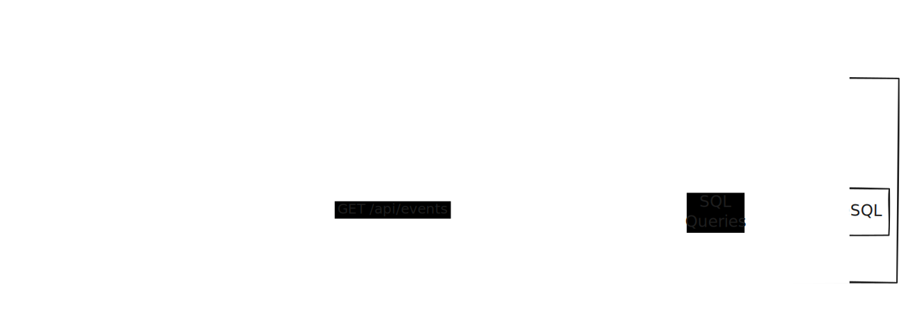

# Plant Moisture Monitor

A real-time plant moisture monitoring dashboard built with Next.js that tracks and visualizes plant soil moisture levels over time.

## Demo

You can find a demo in [here](https://www.thirstyplant.live/).

## Architecture



## Features

- **Real-time Monitoring**: Live dashboard showing current moisture levels
- **Interactive Charts**: Visual representation of moisture data over time using Recharts
- **Plant Visual**: Animated plant graphic that responds to moisture levels
- **Quick Stats**: Summary of recent readings and trends
- **Live Status**: Indicates when data is being actively received

## Tech Stack

- **Framework**: Next.js 15.5.4 with App Router
- **Language**: TypeScript
- **Styling**: Tailwind CSS v4
- **Charts**: Recharts
- **Database**: Neon PostgreSQL
- **UI**: React 19.1.0

## Getting Started

1. **Install dependencies**:

```bash
npm install
```

2. **Run the development server**:

```bash
npm run dev
```

3. **Open the application**:
   Navigate to [http://localhost:3000](http://localhost:3000) to view the dashboard.

## Available Scripts

- `npm run dev` - Start development server with Turbopack
- `npm run build` - Build the application for production
- `npm run start` - Start the production server
- `npm run lint` - Run ESLint for code quality

## API Endpoints

- `GET /api/events` - Retrieve moisture sensor data
- `POST /api/events` - Post new moisture sensor data

## Environment Setup

Make sure to configure your database connection for the Neon PostgreSQL integration used by the `/api/events` endpoint.
